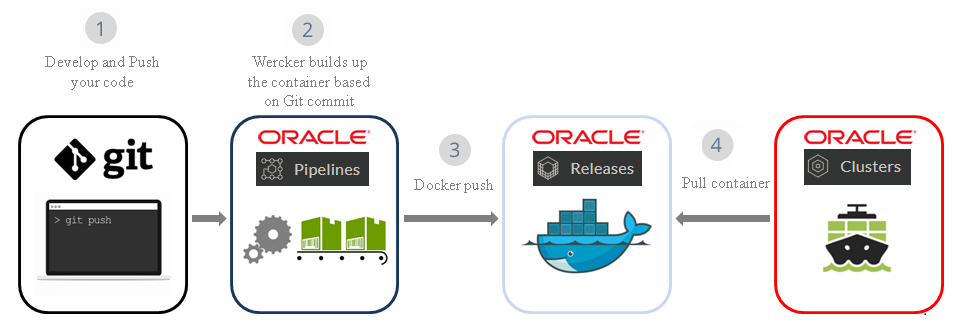

# ORACLE Container Native DevOps workshop #

### About this hands-on workshop ###

This lab is designed for people with no prior experience with Docker, Node.js, AngularJS and want to learn the core concepts and basics of Container Native DevOps. 

The demo application is a simple Credit Scoring application. It has a Node.js backend microservice which calculates the credit score based on name, date of birth and SSN. The application UI which invokes the backend miscroservice using REST interface is built on AngularJS.

Oracle services being used during the hands-on are the following:

+ **Oracle Container Pipelines (OCP - former Wercker)** is a Docker-Native CI/CD  Automation platform for Kubernetes & Microservice Deployments. OCP is integrated with Docker containers, which package up application code and can be easily moved from server to server. Each build artifact can be a Docker container. The user can take the container from the Docker Hub or his private registry and build the code before shipping it. Its SaaS platform enables developers to test and deploy code often. They can push software updates incrementally as they are ready, rather than in bundled dumps. It makes it easier for coders to practice continuous integration, a software engineering practice in which each change a developer makes to the codebase is constantly tested in the process so that software doesn’t break when it goes live.
+ **Oracle Container Registry** is a v2 container registry to store and retrieve containers.

+ **Oracle Container Engine** is an Oracle managed Kubernetes Cluster enviroment to deploy and run container packaged applications.

**Architecture**

### Prerequisites ###

- [Oracle Container Pipeline/Registry/Cluster](https://app.wercker.com) enabled account.
- [Github account](sign.up.github.md)
- [Oracle Container Engine instance provisioned on Oracle Cloud Infrastructure.](FastStartSettingUpContainerNative_v3.pdf)
- [Ingress controller](setup.ingress.controller.md)

### The topics to be covered in this hands-on session are: ###

1. [Create Oracle Container Pipeline to build, test and package sample application](sample.app.pipeline.md)
2. [Application Lifecycle Management (Web - Github)](change.application.md)
3. [Application Lifecycle Management (Desktop - Oracle Container Pipelines CLI)](change.application.desktop.md)

### License ###
Copyright (c) 2014, 2016 Oracle and/or its affiliates
The Universal Permissive License (UPL), Version 1.0
