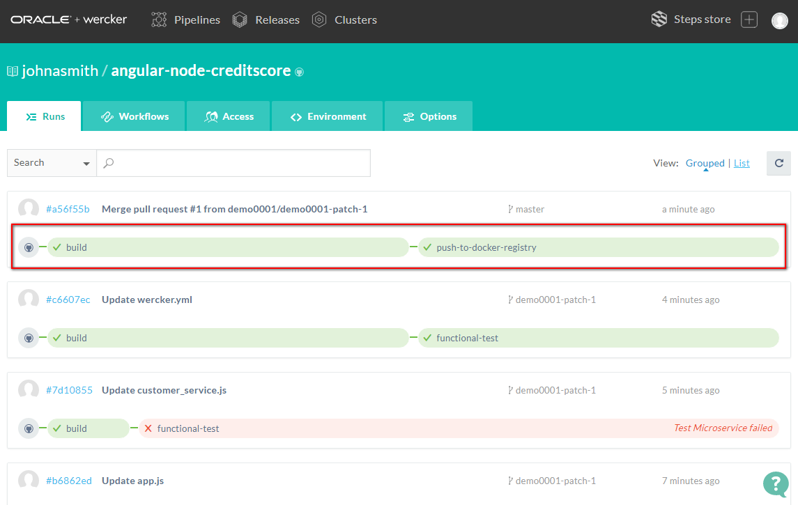
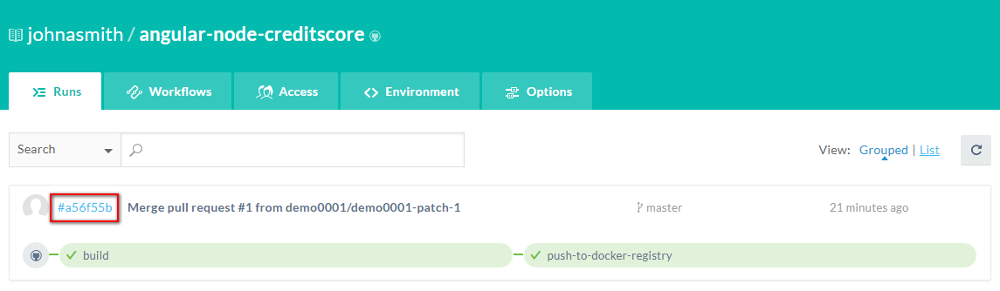
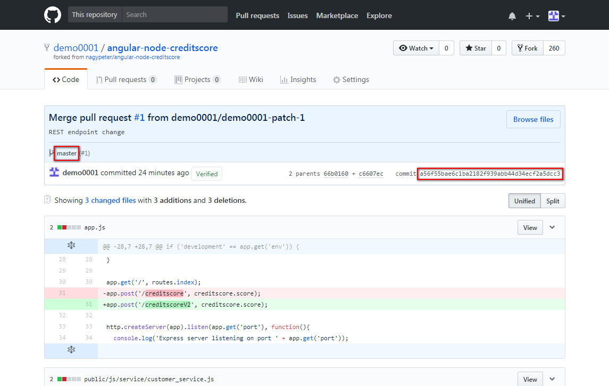
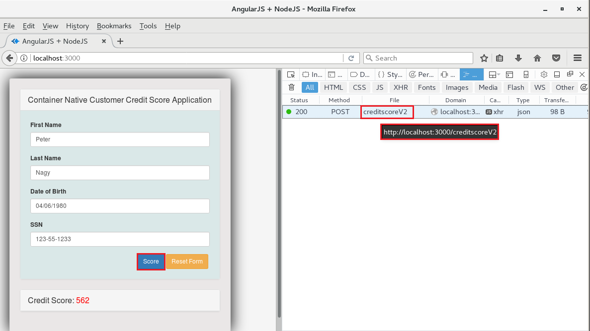

## Application Lifecycle Management ##

Make sure you are signed in to [https://github.com](https://github.com) and [https://app.wercker.com](https://app.wercker.com). It is recommended to open two browser windows/tabs for [https://github.com](https://github.com) and [https://app.wercker.com](https://app.wercker.com) because you need to use both of them in parallel.

The first use case for Application Lifecycle Management is the following simplified scenario which includes a github pull and merge request:

1. Change the context path of the backend microservice using a new branch.
2. Commit the changes and check the CI/CD workflow. The non-master branch executes the test route.
3. The test fails.
4. Update the test case and the UI REST endpoint address and commit.
5. Test passes.
6. Create pull request to the master branch.
7. Merge the pull request.
8. The master branch executes the store and deploy route.
9. Check the modified application locally on your desktop.

### Change the application source code ###

First switch to the browser where [github.com](https://github.com) is opened (or open and sign in) and find the `app.js` file in your *angular-node-creditscore* repository which defines the REST endpoint's context path. You can reach this file directly too, just type the following URL: `https://github.com/GITHUB_USERNAME/angular-node-creditscore/blob/master/app.js`. Click on the pencil icon to edit.

Modify the following method's first parameter (~31. line):

	app.post('/creditscore', creditscore.score);

to

	app.post('/creditscoreV2', creditscore.score);

Set the commit message and select the **Create new branch** option. You can leave the default name and click **Propose file change**.

Change the browser to Oracle Container Pipelines and wait for the build's result. The test fails. To get more details click on the *functional-test* pipeline.

Scroll down to the *Test Microservice* part and you can see the original context path and the 404 HTTP error code.

### Update the test case and other references to the new endpoint ###

Change back to the browser where [github.com](https://github.com) is opened and find the `wercker.yml` file in your *angular-node-creditscore* repository. You can reach this file directly too, just type the following URL: `https://github.com/GITHUB_USERNAME/angular-node-creditscore/blob/master/wercker.yml`. Click on the pencil icon to edit.

Update the `CREDITSCORE_URL` variable which defines the REST endpoint URL to:

	CREDITSCORE_URL=http://localhost:3000/creditscoreV2

Set a commit message and make sure the patch branch (previously created) is selected. Commit the changes.

Finally modify the UI REST endpoint configuration. Find the `/public/js/service/customer_service.js` file in your *angular-node-creditscore* repository. You can reach this file directly too, just type the following URL: `https://github.com/GITHUB_USERNAME/angular-node-creditscore/blob/PATCH_BRANCH_NAME/public/js/service/customer_service.js`. Make sure the patch branch selected. Click on the pencil icon to edit.

Update the `REST_SERVICE_URI` variable properly in the line #5 to:

	var REST_SERVICE_URI = './creditscoreV2';

Set a commit message and commit changes directly to the patch branch.

The commit triggers the build workflow. Change the browser window/tab to Oracle Container Pipelines and wait for the result. When the workflow completed click on the *functional-test* pipeline to check the test log.

Please note you have two successful workflow runs because each commit triggered one. Usually developers use git client and commits more changes together which makes one run. It is not general to change the sources using Git Web UI which caused the multiple run.

Scroll down and open the *Test Microservice* log. Please note the URL changes and the successful request what is confirmed by HTTP 200 response.

Now the application changes has been tested. Now the source changes are ready to push to the master branch.

### Create pull request and merge the changes ###

Switch back to the browser where the [github.com](https://github.com) is already opened. Go to the root of the *angular-node-creditscore* repository and select the patch branch and click **New pull request**.

Using this page you can create a pull request to master branch. It is important to select the correct base and head. Most likely the default base (fork) is set to the original (*https://github.com/nagypeter/angular-node-creditscore*) repository. **CHANGE THIS BASE TO YOUR FORK!!!!!!** Make sure the base fork has the master branch. The head fork defaults usually good, but please check the head fork points to your (forked) repository and the pull request based on the patch you created.

After the correct configuration set github shows the merge has no conflict. Set the pull request message and click **Create pull request**.

Because you don't use different roles (github.com users) the merge for pull request immediately appears. You can check the commits belong to the patch and initiate the merge by click **Merge pull request**.

After the automatic merge you need to commit the changes to the master branch. Click **Confirm merge** to do so.

This commit to the master branch triggers the build workflow again. Change the browser window/tab to Oracle Container Pipelines and wait for the result. Now the store and deploy route runs. Please note the generated commit tag what is the name of the workflow execution.

### Check the application changes ###

Finally test the modified application uploaded to Docker Hub (registry) which now uses the new endpoint of the backend service. 

First you need to get the new tag for the latest container. Please note the tag is basically the corresponding hash of the commit which triggered the build. You can verify this assignment in the *wercker.yml* in the *push-to-dockerhub* pipeline definition:

	# pipeline to store container on Docker Hub
	push-to-dockerhub:
	    steps:
	      # Push to public docker repo
	      - internal/docker-push:
	          username: $DOCKER_USERNAME
	          password: $DOCKER_PASSWORD
	          tag:  $WERCKER_GIT_BRANCH-$WERCKER_GIT_COMMIT
	          repository: $DOCKER_USERNAME/$WERCKER_APPLICATION_NAME
	          registry: https://index.docker.io/v2/
	          cmd: node /pipeline/source/app.js

The tag number is constructed from the git branch name and the hash of the git commit. To get this string click on the **Run** tab in Oracle Pipelines and find the first part of the commit hash next to the name of the latest build. Click the string.

Find the full commit hash in the header of the merge details and note for the next step.

Once you have the commit hash construct the tag which has the following format: <BRANCH_NAME>-<COMMIT_HASH>. The branch name has to be *master*. Using the data above the tag is: `master-a56f55bae6c1ba2182f939abb44d34ecf2a5dcc3`. To run the modified application use *docker run* to pull and execute the specific (tagged) container packaged application locally on your desktop: `docker run -d -p3000:3000 YOUR_DOCKER_USERNAME/angular-node-creditscore:master-a56f55bae6c1ba2182f939abb44d34ecf2a5dcc3` Don't forget to replace to your docker user name and the tag what you got in the previous step.

	[oracle@localhost ~]$ docker run -d -p3000:3000 demo0001/angular-node-creditscore:master-a56f55bae6c1ba2182f939abb44d34ecf2a5dcc3
	Unable to find image 'demo0001/angular-node-creditscore:master-a56f55bae6c1ba2182f939abb44d34ecf2a5dcc3' locally
	master-a56f55bae6c1ba2182f939abb44d34ecf2a5dcc3: Pulling from demo0001/angular-node-creditscore
	10a267c67f42: Already exists 
	fb5937da9414: Already exists 
	9021b2326a1e: Already exists 
	dbed9b09434e: Already exists 
	74bb2fc384c6: Already exists 
	9b0a326fab3b: Already exists 
	8089dfd0519a: Already exists 
	f2be1898eb92: Already exists 
	2d9020bafca2: Pull complete 
	Digest: sha256:dce47a0b843fac63547bec453f9775c458e241c452590132b5d5f269fd0008af
	Status: Downloaded newer image for demo0001/angular-node-creditscore:master-a56f55bae6c1ba2182f939abb44d34ecf2a5dcc3
	e7fa15ed3bed1ae069c5d17caaa72cf40e5f5745fa5bcc12bd6ca685d6d1c7bc
	[oracle@localhost ~]$ 

 
This version of image didn't exist locally so docker pulled from your Docker Hub repository. Using `docker ps` check the running container instance(s):

	[oracle@localhost ~]$ docker ps
	CONTAINER ID        IMAGE                                                                               COMMAND                  CREATED              STATUS              PORTS                    NAMES
	e7fa15ed3bed        demo0001/angular-node-creditscore:master-a56f55bae6c1ba2182f939abb44d34ecf2a5dcc3   "node /pipeline/sour…"   About a minute ago   Up About a minute   0.0.0.0:3000->3000/tcp   vigorous_meninsky
	[oracle@localhost ~]$ 

Open a browser and test the application which is available on *http://localhost:3000*.

Before the application test open the browser's console using **Ctrl+Shift+I** and select the **Network** tab. Set the necessary fields and click **Score**. In the network console page you have to see the REST endpoint invocation which is `creditscoreV2`. You can see the complete backend service URL when you hover the mouse pointer on `creditscoreV2` network event. Please note the `V2` postfix in the complete URL.

Stop the container using `docker stop <CONTAINER_ID>` command. The <CONTAINER_ID> can be found in the `docker ps` result.

	[oracle@localhost ~]$ docker ps
	CONTAINER ID        IMAGE                                                                               COMMAND                  CREATED             STATUS              PORTS                    NAMES
	e7fa15ed3bed        demo0001/angular-node-creditscore:master-a56f55bae6c1ba2182f939abb44d34ecf2a5dcc3   "node /pipeline/sour…"   8 minutes ago       Up 8 minutes        0.0.0.0:3000->3000/tcp   vigorous_meninsky
	[oracle@localhost ~]$ docker stop e7fa15ed3bed
	e7fa15ed3bed
	[oracle@localhost ~]$ 

