## Create Oracle Container Pipeline to build, test and package sample application ##

Make sure you are signed in to [https://github.com](https://github.com) and [https://app.wercker.com](https://app.wercker.com). It is recommended to open two browser windows/tabs [https://github.com](https://github.com) and [https://app.wercker.com](https://app.wercker.com) because you need to use both of them in parallel.

In this tutorial we automatically create namespaces in the kubernetes cluster based on your username in Oracle Container Pipelines. The namespace in kubernetes can not contain any uppercase character. So if your username contains uppercase characters please change it inside the profile.

The use case for the simplified Continuous Integration/Continuous Deployment (CI/CD) is the following using Oracle Container Pipelines:

1. Get the application sources
2. Build the application. (In case of Node.js it's about installation of packages.)
3. Validate the application using functional test
4. Store the containerized application to Docker Hub
5. Pull and test the application on desktop

### Fork the sample application sources ###

First you need a *github.com* based source code repository for the sample application what feeds the Oracle Container Pipelines. 

Open the browser window/tab where github.com is opened and type the following URL into the address bar (or click on the link): [https://github.com/nagypeter/angular-node-creditscore](https://github.com/nagypeter/angular-node-creditscore). Click on **Fork** to fork the sample application to your repository.

### Create application pipelines ###

When the fork is done change to the browser where [https://app.wercker.com](https://app.wercker.com) is open. Select **Pipelines** and click **Create an application** to create a new pipeline. (You can click on the plus sign at the top right corner and select **Add application** too.)

First select the repository you want to use as sources. By default it will show your Github provider and the available repositories. Select *angular-node-creditscore* and click **Use selected repo**.

Select the application owner. Use the default user and don't select the organization if exists.

In case of private repositories you should define the access method. Since the the sample repository created as public you can leave the default checkout method. Click **Next step**.

Finally you can choose whether your application is public or not. We recommend to leave default which means the application will be private. Click **Finish** to create your application.

The next page offers to generate specific `wercker.yml` based on the application's language and the to start the build. The sample application already has a `wercker.yml`, but before the first build define the complete workflow which will deploy the application to Oracle Container Engine. 

Before you move forward please inspect the *wercker.yml*. The source is available under your github repository. Open a new browser (tab) and go directly to *https://github.com/<YOUR_GITHUB_USERNAME>/angular-node-creditscore/blob/master/wercker.yml*. The configuration should be similar:

	box: node:6.10
	build:
	  steps:
	    - script:
	        name: A step that executes `npm install` command
	        code: npm install  
	
	...
	        
	# pipeline to store container on Docker Hub
	push-to-dockerhub:
	    steps:
	      # Push to public docker repo
	      - internal/docker-push:
	          username: $DOCKER_USERNAME
	          password: $DOCKER_PASSWORD
	          tag:  $WERCKER_GIT_BRANCH-$WERCKER_GIT_COMMIT
	          repository: $DOCKER_USERNAME/$WERCKER_APPLICATION_NAME
	          registry: https://index.docker.io/v2/
	          cmd: node /pipeline/source/app.js
	
	...
	
	# pipeline to execute functional test on application's microservice endpoint
	# single curl invocation
	rest-functional-test:
	  steps:
	    - script:
	        name: Test Microservice
	        code: |
	              mkdir -p "/pipeline"
	              node $WERCKER_ROOT/app.js &
				  ...
           

The *wercker.yml* defines the configuration of your automation pipelines with a collection of Steps that you wish to execute.
In your *wercker.yml* you can specify any pipeline you like. There is one special pipeline called `dev` which will only be executed when running it with the CLI using the wercker dev command. Examples of pipeline names: *build*, *push-to-registry, rest-functional-test*, etc.

A pipeline can have its own base box (Docker container), like in this example the *node:6.10* official Node.js Docker container. You can use different base boxes per pipeline.

As you can see in this configuration we have the default pipeline *build* which executes the *npm-install* build, a *push-to-dockerhub* pipeline which will upload the container packaged application to Docker Hub and the *rest-functional-test* pipeline which is intended to test the application during the CI/CD workflow. You will create these pipelines in the next steps.

Please also note the environment variables ($DOCKER_USERNAME, $DOCKER_PASSWORD) usage which enables flexible configuration and safe authentication. When the pipelines and the workflow created you will define these variables and set the values.

### Define CI/CD workflow ###

In this use case our CI/CD workflow has two potential forked routes of the flow. One for non-master (any patch) branch to test the application changes. The a second one for master branch to store the modified and tested application.

Now select the **Workflow** tab and define the first pipeline. As mentioned upon creating a project in Wercker, it creates a *build* Workflow with a Git hook which executes a build pipeline. This means whenever you push changes into your github repository then a new build will be triggered. Now add a new pipeline what will do the Docker container image push to Docker Hub. Click **Add new pipeline**.

+ **Name**: *push-to-docker-registry* (but can be anything else)
+ **YML Pipeline name**: it has to be *push-to-dockerhub*, because we already defined this pipeline using this name in  the *wercker.yml*.
+ **Hook type**: leave default to chain this Pipeline.

Finally click **Create**.

Go back to the Workflow page and click **Add new pipeline** again.

+ **Name**: *functional-test* (but can be anything else)
+ **YML Pipeline name**: it has to be *rest-functional-test*, because we already defined this pipeline using this name in  the *wercker.yml*.
+ **Hook type**: leave default to chain this Pipeline.

Finally click **Create**.

Go back to the Workflow page and you have to see your new pipelines.

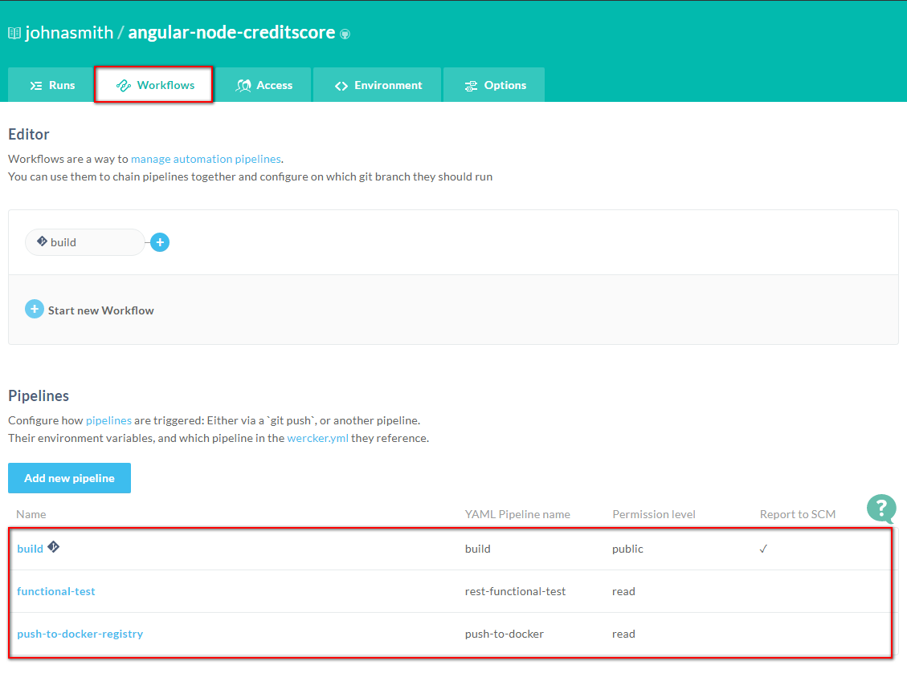

The next step is to define the workflow using the pipelines. First define the workflow route for master (tested application which needs to store in container registry) branch. Click the blue plus icon after the *build* pipeline to add the container registry store pipeline. Set *master* branch as routing filter and select the *push-to-docker-registry* pipeline from the **Execute pipeline** dropdown list. Click **Add**.

Now define the test route of the workflow for non-master (patching) branches. Click the blue plus icon after the *build* pipeline again to add the functional test pipeline. Set *master* for **Not on branch(es)** as routing filter and select the *functional-test* pipeline from the **Execute pipeline** dropdown list. Click **Add**.

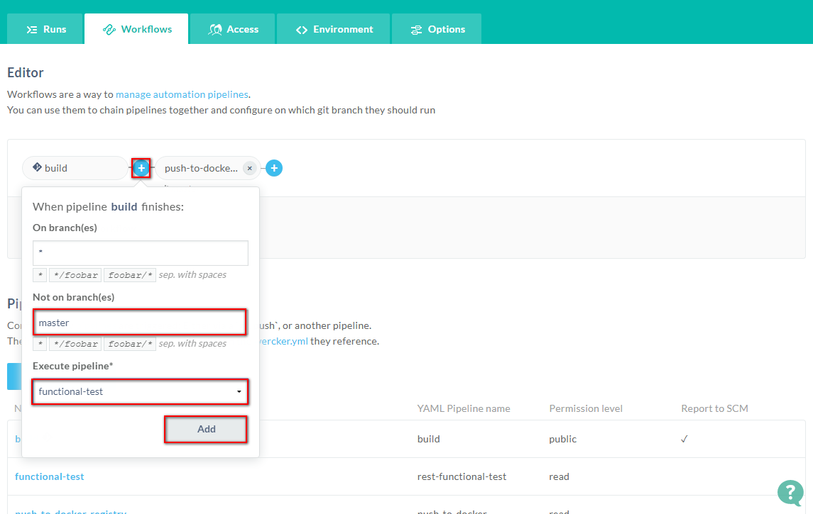

Now the workflow for a simplified DevOps use case is ready.

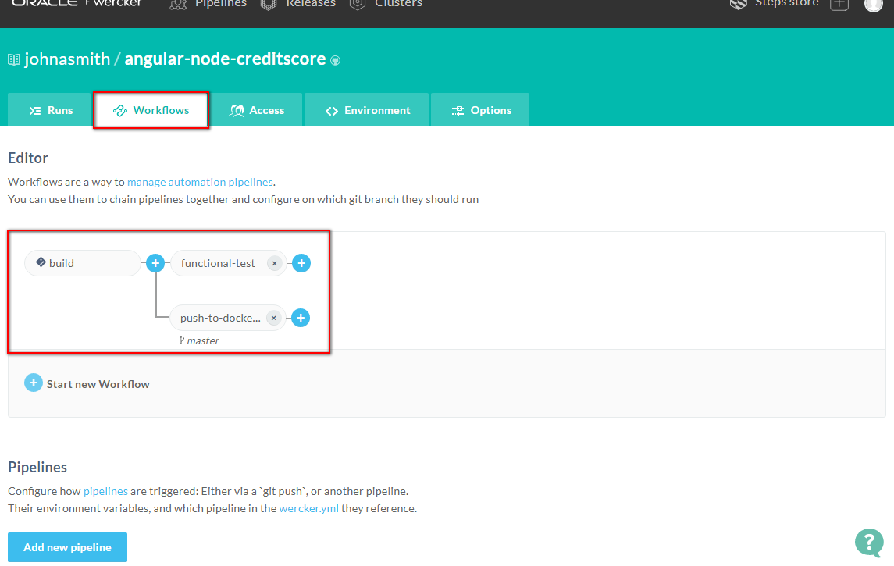

### Define configuration variables ###

The only thing what is missing to run the workflow is the enviroment configuration. The pipelines basically run within Oracle Container Pipelines but at the and of a successful build the workflow stores the packaged application to Docker Hub (~Docker Registry) what requires authentication so you need to define your Docker user name and password as environment variables. Please note `$DOCKER_USERNAME` and `$DOCKER_PASSWORD` variables definition in the wercker.yml at *push-to-dockerhub* pipeline.

To set proper values go back your application select **Pipelines** and your application (angular-node-creditscore). 

The pipelines can have independent variables per pipelines or *global* scope variables. To simplify the configuration define *global* scope variables. Click the **Workflow** tab then select **Environment** tab. Set the name and value pairs for the following configuration variables.

+ **DOCKER\_USERNAME** = your Docker user name (don't use the email address instead of the username)
+ **DOCKER\_PASSWORD** = your Docker password

When you need to add new variable click **Add** button which saves the current row and add a new one. You can use the **Protected** tick box to store safely your password.

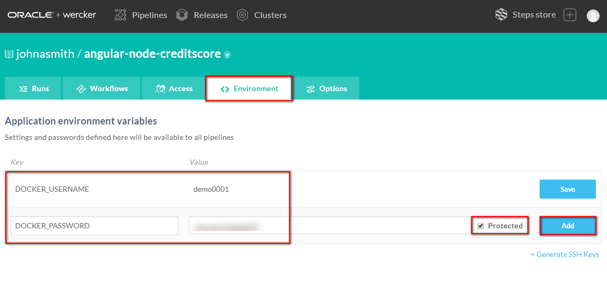

### Execute the workflow ###

In general the workflow is triggered by git changes, but first time you need to start. Switch to **Runs** tab and select **trigger a build now** link.

When the build started it change to the build step's logs.

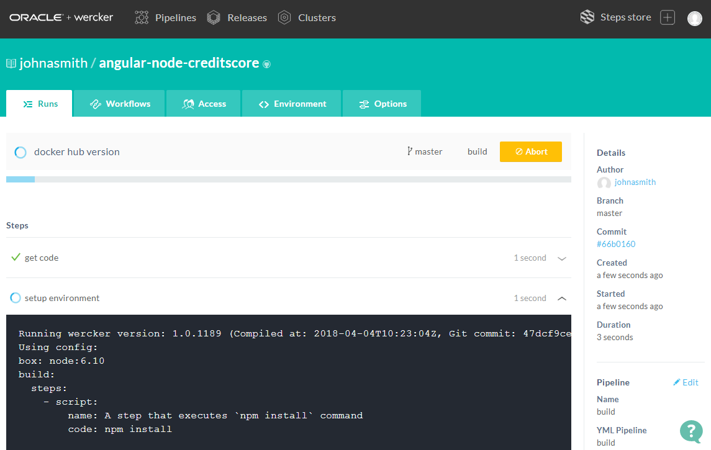

Select **Runs** tab to monitor the workflow status.

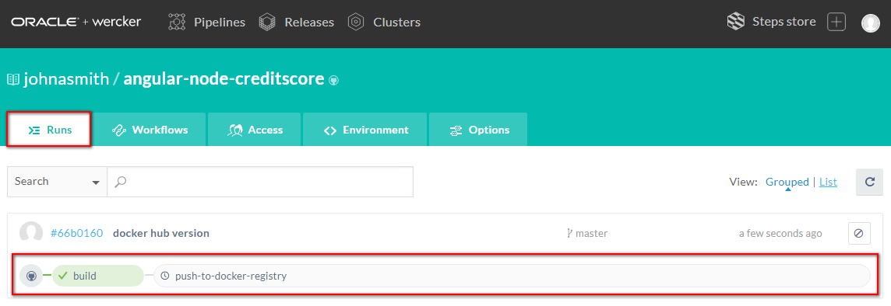

When the pipeline *push-to-docker-registry* is completed (marked with green background) you may verify that the container image including application bits and dependencies was really pushed to Docker Hub. To verify this open a new browser (tab) go and sign in to [https://cloud.docker.com](https://cloud.docker.com)

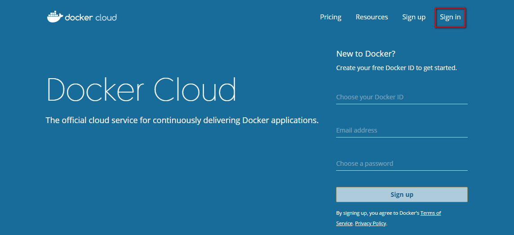

Enter your credentials and click Login.

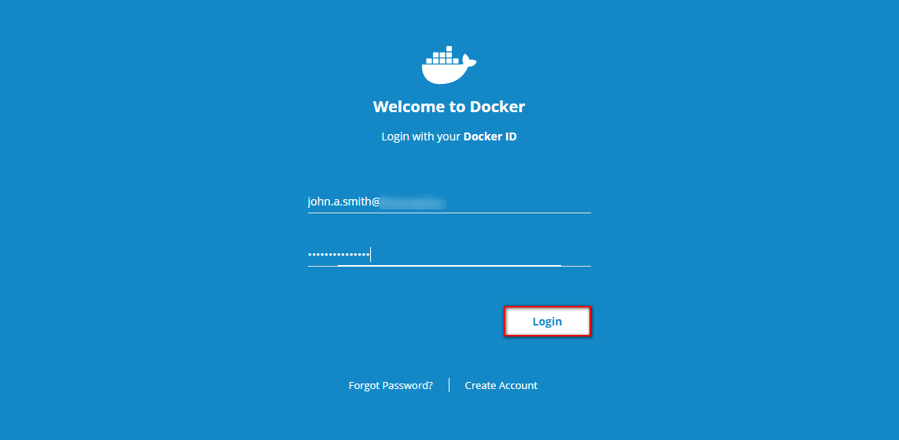

Select the Repositories tab and check you have a new repository called *DOCKER_USERNAME/angular-node-creditscore*

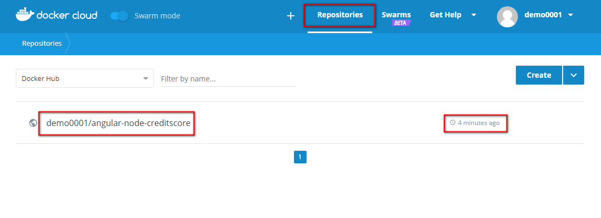

### Test application on your desktop ###

The container packaged application ready and uploaded to a docker registry. To test the application pull and run the image on your desktop. This requires Docker runtime environment (Engine) installed on your desktop.

To determine the container tag which is necessary to specify the container to pull click *DOCKER_USERNAME/angular-node-creditscore* repository.

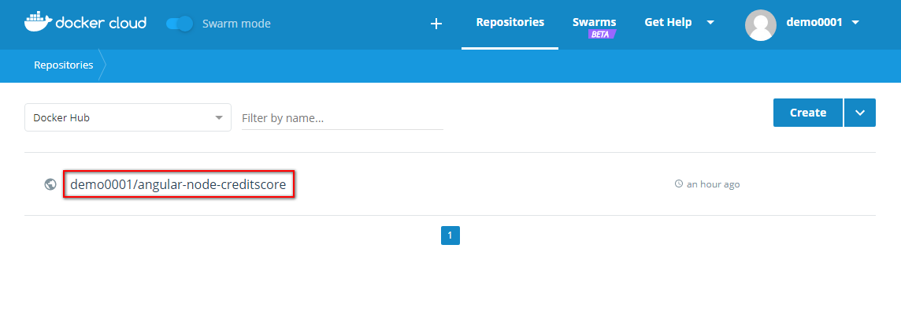

Select **Tags** tab and copy the tag for the next step.

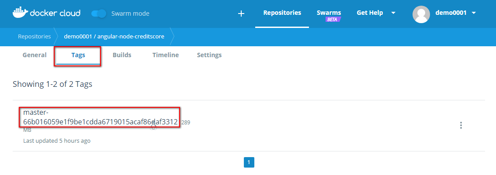

Please note the tag is basically the corresponding hash of the commit which triggered the build. You can verify this assignment in the *wercker.yml* in the *push-to-dockerhub* pipeline definition:

	# pipeline to store container on Docker Hub
	push-to-dockerhub:
	    steps:
	      # Push to public docker repo
	      - internal/docker-push:
	          username: $DOCKER_USERNAME
	          password: $DOCKER_PASSWORD
	          tag:  $WERCKER_GIT_BRANCH-$WERCKER_GIT_COMMIT
	          repository: $DOCKER_USERNAME/$WERCKER_APPLICATION_NAME
	          registry: https://index.docker.io/v2/
	          cmd: node /pipeline/source/app.js

The tag number is constructed from the git branch name and the hash of the git commit.

Once you have the tag you can use `docker run` to pull and execute your container packaged application locally on your desktop: `docker run -d -p3000:3000 YOUR_DOCKER_USERNAME/angular-node-creditscore:master-66b016059e1f9be1cdda6719015acaf86daf3312` Don't forget to replace to your docker user name and the tag what you got in the previous step.

	[oracle@localhost ~]$ docker run -d -p3000:3000 YOUR_DOCKER_USERNAME/angular-node-creditscore:master-66b016059e1f9be1cdda6719015acaf86daf3312
	Unable to find image 'demo0001/angular-node-creditscore:master-66b016059e1f9be1cdda6719015acaf86daf3312' locally
	master-66b016059e1f9be1cdda6719015acaf86daf3312: Pulling from demo0001/angular-node-creditscore
	10a267c67f42: Already exists 
	fb5937da9414: Already exists 
	9021b2326a1e: Already exists 
	dbed9b09434e: Already exists 
	74bb2fc384c6: Already exists 
	9b0a326fab3b: Already exists 
	8089dfd0519a: Already exists 
	f2be1898eb92: Already exists 
	f8a065987356: Already exists 
	Digest: sha256:fdc0b109c8d122536befe26c63cc461006a1dc056d754fdc097567a2a1493d6c
	Status: Downloaded newer image for demo0001/angular-node-creditscore:master-66b016059e1f9be1cdda6719015acaf86daf3312
	d66ca58a3bdf857f15295acb2084ded5da9579a812049fdd11f52c27e7a82a22
	[oracle@localhost ~]$ 
 
The image didn't exist locally so docker pulled from your Docker Hub repository. Using `docker ps` check the running container instance(s):

	[oracle@localhost ~]$ docker ps
	CONTAINER ID        IMAGE                                                                               COMMAND                  CREATED             STATUS              PORTS                    NAMES
	d66ca58a3bdf        demo0001/angular-node-creditscore:master-66b016059e1f9be1cdda6719015acaf86daf3312   "node /pipeline/sour…"   9 minutes ago       Up 9 minutes        0.0.0.0:3000->3000/tcp   determined_shaw
	[oracle@localhost ~]$ 

Open a browser and test the application which is available on *http://localhost:3000*.

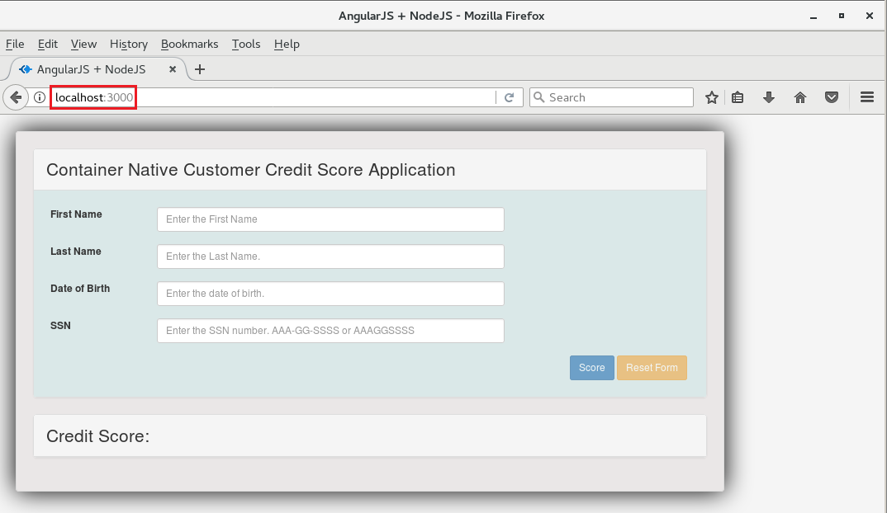

Test your Credit Score application using sample data.

Stop the container using `docker stop <CONTAINER_ID>` command. The <CONTAINER_ID> can be found in the `docker ps` result.

	[oracle@localhost ~]$ docker ps
	CONTAINER ID        IMAGE                                                                               COMMAND                  CREATED             STATUS              PORTS                    NAMES
	d66ca58a3bdf        demo0001/angular-node-creditscore:master-66b016059e1f9be1cdda6719015acaf86daf3312   "node /pipeline/sour…"   40 minutes ago      Up 40 minutes       0.0.0.0:3000->3000/tcp   determined_shaw
	[oracle@localhost ~]$ docker stop d66ca58a3bdf
	d66ca58a3bdf
	[oracle@localhost ~]$ 

