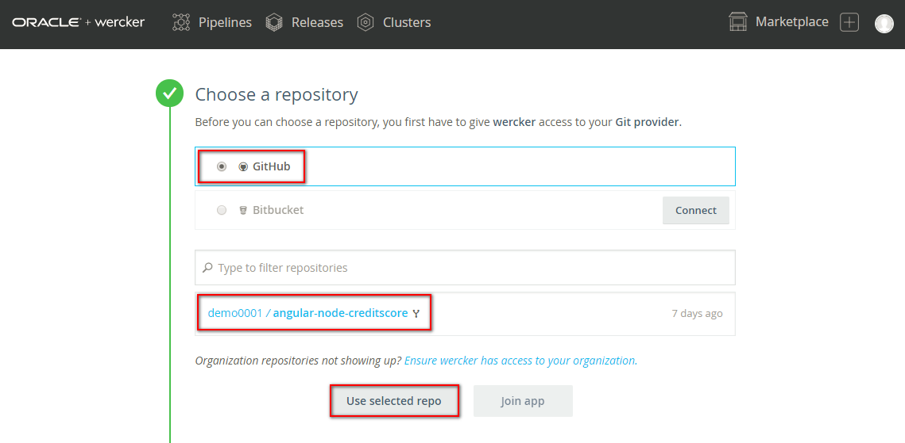
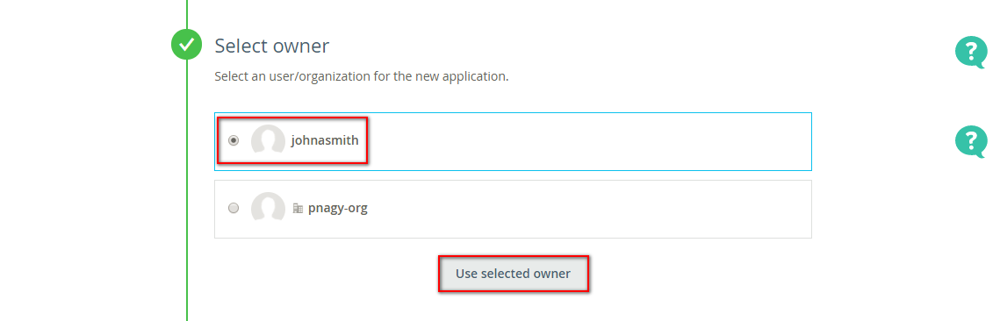
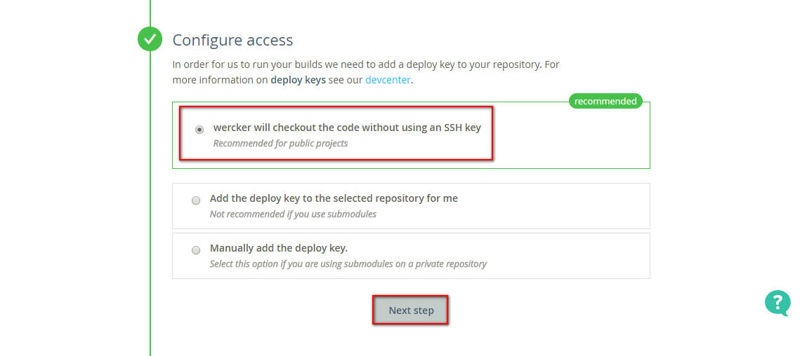
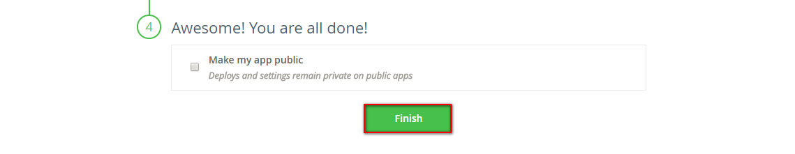

## Create Oracle Container Pipeline to build, test and package sample application ##

Make sure you are signed in to [https://github.com](https://github.com) and [https://app.wercker.com](https://app.wercker.com). It is recommended to open two browser windows/tabs [https://github.com](https://github.com) and [https://app.wercker.com](https://app.wercker.com) because you need to use both of them in parallel.

The use case for the simplified Continuous Integration/Continuous Deployment is the following using Oracle Container Pipelines:

1. Get the application sources
2. Build the application. (In case of Node.js it's about installation of packages.)
3. Validate the application using functional test
4. Store the containerized application to Oracle Container Registry 
5. Deploy the application to Oracle Container Engine

### Fork the sample application sources ###

First you need a github.com based source code repository for the sample application what feeds the Oracle Container Pipelines. 

Open the browser window/tab where github.com is opened and type the following URL into the address bar (or click on the link): [https://github.com/nagypeter/angular-node-creditscore](https://github.com/nagypeter/angular-node-creditscore). Click on **Fork** to fork the sample application to your repository.

### Create application pipelines ###

When the fork is done change to the browser where [https://app.wercker.com](https://app.wercker.com) is open. Select **Pipelines** and click **Create an application** to create a new pipeline. (You can click on the plus sign at the top right corner and select **Add application** too.)

First select the repository you want to use as sources. By default it will show your Github provider and the available repositories. Select *angular-node-creditscore* and click **Use selected repo**.

Select the application owner. Use the default user and don't select the organization if exists.

In case of private repositories you should define the access method. Since the the sample repository created as public you can leave the default checkout method. Click **Next step**.

Finally you can choose whether your application is public or not. We recommend to leave default which means the application will be private. Click **Finish** to create your application.

The next page offers to generate specific `wercker.yml` based on the application's language and the to start the build. The sample application already has a `wercker.yml`, but before the first build define the complete workflow which will deploy the application to Oracle Container Engine. 

Before you move forward please inspect the *wercker.yml*. The source is available under your github repository. Open a new browser (tab) and go directly to *https://github.com/<YOUR_GITHUB_USERNAME>/nodejs-mongodb-crud/blob/master/wercker.yml*. The configuration should be the same:

	box: node:6.10
	build:
	  steps:
	    - script:
	        name: A step that executes `npm install` command
	        code: npm install  
	
	push-to-releases:
	  steps:
	    # Push to public docker repo Container Registry (CR)
	    - internal/docker-push:
	        tag: $WERCKER_GIT_BRANCH-$WERCKER_GIT_COMMIT
	        cmd: node /pipeline/source/app.js
	
	deploy-to-oke:
	  box:
	        id: alpine
	        cmd: /bin/sh
	  steps:
	    - bash-template
	    
	    - kubectl:
	        name: delete namespace
	        server: $KUBERNETES_MASTER
	        token: $KUBERNETES_TOKEN
	        insecure-skip-tls-verify: true
	        command: delete namespace $WERCKER_APPLICATION_OWNER_NAME --ignore-not-found=true
	    ...	        
	    - kubectl:
	        name: create deplyoment
	        server: $KUBERNETES_MASTER
	        token: $KUBERNETES_TOKEN
	        insecure-skip-tls-verify: true
	        command: create -f $WERCKER_ROOT/kubernetes-deployment.yml --namespace=$WERCKER_APPLICATION_OWNER_NAME
		...	

	rest-functional-test:
	  steps:
	    - script:
	        name: Test Microservice
	        code: |
	              mkdir -p "/pipeline"
	              node $WERCKER_ROOT/app.js &
				  ...
           

The *wercker.yml* defines the configuration of your automation pipelines with a collection of Steps that you wish to execute.
In your *wercker.yml* you can specify any pipeline you like. There is one special pipeline called `dev` which will only be executed when running it with the CLI using the wercker dev command. Examples of pipeline names: *build*, *push-to-releases, rest-functional-test*, etc.

A pipeline can have its own base box (Docker container), like in this example the *node:6.10* official Node.js Docker container. You can use different base boxes per pipeline.

As you can see in this configuration we have the default pipeline *build* which executes the *npm-install* build, a *push-to-releases* pipeline which will upload the container packaged application to Oracle Container Registry, a *deploy-to-oke* pipeline which deploys the application to Oracle Container Engine and the *rest-functional-test* pipeline which is intended to test the application during the CI/CD workflow. You will create these pipelines in the next steps.

Please also note the environment variables ($KUBERNETES_MASTER, $KUBERNETES_MASTER) usage which enables flexible configuration and safe authentication. When the pipelines and the workflow created you will define these variables and set the values.

### Define CI/CD workflow ###

In this use case our CI/CD workflow has to routes. One for non-master (any patch) branch to test the application changes. The a second one for master branch to store and deploy the modified and tested application.

Now select the **Workflow** tab and define the first pipeline. As mentioned upon creating a project in Wercker, it creates a *build* Workflow with a Git hook which executes a build pipeline. This means whenever you push changes into your github repository then a new build will be triggered. Now add a new pipeline what will do the Docker container image push to Oracle Container Registry. Click **Add new pipeline**.

+ **Name**: *push-to-OCR* (but can be anything else)
+ **YML Pipeline name**: it has to be *push-to-releases*, because we already defined this pipeline using this name in  the *wercker.yml*.
+ **Hook type**: leave default to chain this Pipeline.

Finally click **Create**.

Go back to the Workflow page and click **Add new pipeline** again.

+ **Name**: *functional-test* (but can be anything else)
+ **YML Pipeline name**: it has to be *rest-functional-test*, because we already defined this pipeline using this name in  the *wercker.yml*.
+ **Hook type**: leave default to chain this Pipeline.

Finally click **Create**.

Go back to the Workflow page and click **Add new pipeline** again.

+ **Name**: *deploy-to-Prod* (but can be anything else)
+ **YML Pipeline name**: it has to be *deploy-to-oke*, because we already defined this pipeline using this name in  the *wercker.yml*.
+ **Hook type**: leave default to chain this Pipeline.

Finally click **Create**.

Go back to the Workflow page and you have to see your new pipelines.

The next step is to define the workflow using the pipelines. First define the workflow route for master (tested application allowed to store and deploy) branch. Click the blue plus icon after the *build* pipeline to add the container registry store pipeline. Set *master* branch as routing filter and select the *push-to-OCR* pipeline from the **Execute pipeline** dropdown list. Click **Add**.

Click the blue plus icon after the *push-to-OCR* pipeline to add the container engine deploy pipeline. Leave the default *master* branch as routing filter and select the *deploy-to-Prod* pipeline from the **Execute pipeline** dropdown list. Click **Add**.

Now define the test route of the workflow for non-master (patching) branches. Click the blue plus icon after the *build* pipeline to add the functional test pipeline. Set *master* for **Not on branch(es)** as routing filter and select the *functional-test* pipeline from the **Execute pipeline** dropdown list. Click **Add**.

Now the simple workflow for devOps use case is ready and it has to look similar:

### Get configuration variable's values ###

In this simple use case the configuration is minimalized as possible. You need only two parameters to run this workflow.

First you need an authentication token to access to Oracle Container Registry and Engine. To create such personal token click on your profile image at the top right corner of the page, select **Your profile** and click on **Manage settings**.

On the left side select the **Personal tokens** menu item. Define a token name e.g. your username and click **Generate**.

Make sure to copy your token because you won't be able to get it again! Click **Done**.

The second configuration variable is the address of the Oracle Container Engine where you want to deploy your tested, production ready application.

Select **Clusters** and copy the Kubernetes Address of the target cluster.

### Define configuration variables ###

To go back your application select **Pipelines** and your application (angular-node-creditscore). 

Now you will define *global* scope variables, but you can have independent variables per pipelines. To make sure you define *global* scope variables click the **Workflow** tab then select **Environment** tab. Set the name and value pairs for the following configuration variables.

+ **KUBERNETES\_ADDRESS** = Kubernetes Address with *https://* prefix
+ **KUBERNETES\_TOKEN** = your personal token

When you need to add new variable click **Add** button which saves the current row and add a new one. You can use the **Protected** tick box to store safely your value e.g. personal token.

### Execute the workflow ###

In general the workflow is triggered by git changes, but first time you need to start. Switch to **Runs** tab and select **trigger a build now** link.

When the build started it change to the build step's logs.

Select **Runs** tab to monitor the workflow status.

When the workflow is completed click on the last *deploy-to-Prod* pipeline.

Scroll down to open the *get LoadBalancer public IP address* step and check the log. At the end of the log copy the Public IP address of the Ingress controller.

Open a new browser window or tab and open your sample application using the following URL: `https://PUBLIC_IP_ADDRESS/USERNAME`. Where the USERNAME is your Oracle Container Pipelines (former Wercker) user name. It should be a similar to: `https://129.213.15.72/johnasmith`

Due to the reason that the proper certification hasn't been configured you get a security warning. Ignore and allow to open the page.

Test your Credit Score application using sample data.